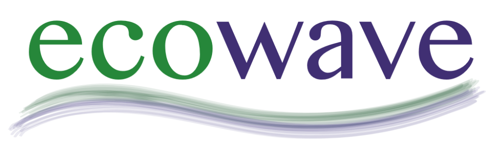

# 🌊 EcoWave - Aplicativo de Vistoria Residencial

> **Eficiência, precisão e profissionalismo na palma da mão.**

O **EcoWave Vistoria** é um Progressive Web App (PWA) de alta performance desenvolvido para técnicos realizarem vistorias de medição individualizada de água e gás com máxima agilidade. A aplicação permite o registro de leituras, captura de fotos, cálculos automáticos de vazão e geração instantânea de relatórios em PDF para compartilhamento imediato.

---

## 🚀 Principais Funcionalidades

- **🚰 Teste de Hidrômetros e Gasômetros:** Registro simplificado de leituras "Antes" e "Após" com cálculo automático do consumo em litros.
- **🔥 Verificação de Pontos de Consumo:** Cálculo de vazão (L/min) para chuveiros e torneiras, integrando tempo de teste e temperatura.
- **📸 Registro Fotográfico:** Captura de fotos diretamente da câmera para comprovação de leituras.
- **✍️ Assinatura Digital:** Coleta de assinatura do cliente diretamente na tela do dispositivo.
- **📄 Relatórios em PDF:** Geração de relatórios profissionais com selo de qualidade, fotos anexadas e dados técnicos completos.
- **🌐 Funcionamento Offline (PWA):** Funciona sem internet após o primeiro acesso, permitindo vistorias em subsolos ou locais com sinal instável.
- **📲 Compartilhamento Ágil:** Envio do relatório final via WhatsApp ou download direto.

---

## 🛠️ Tecnologias Utilizadas

A aplicação foi construída com tecnologias web modernas para garantir leveza e compatibilidade:

- **Core:** HTML5, CSS3 (Vanilla), JavaScript (ES6+).
- **PDF Engine:** [pdfmake](https://pdfmake.org/) para a geração dinâmica de documentos.
- **PWA:** Service Workers para cache e funcionamento offline.
- **UI/UX:** Google Fonts (Outfit) e FontAwesome para uma interface premium e intuitiva.
- **Signature:** Signature Pad nativo via Canvas.

---

## 💻 Como Utilizar Localmente

Para rodar o projeto em sua máquina local:

1.  Clone este repositório.
2.  Abra o arquivo `index.html` em seu navegador ou execute o script `iniciar_servidor.command` (exclusivo para macOS).
3.  Para a melhor experiência, utilize o Chrome ou Safari em dispositivos móveis.

---

## 📦 Deployment

O projeto está pronto para ser hospedado em plataformas como **GitHub Pages**, **Vercel** ou **Netlify**. Basta realizar o upload dos arquivos da raiz.

Certifique-se de que o site seja servido via **HTTPS** para que o Service Worker e a Câmera funcionem corretamente.

---

## 📄 Licença

Este projeto é de uso exclusivo da **EcoWave**. Todos os direitos reservados.

---
*Desenvolvido com foco na excelência técnica e experiência do usuário.*
